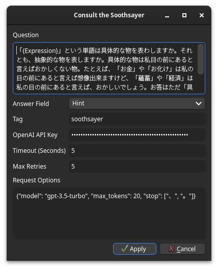

# Soothsayer for Anki


This addon asks [ChatGPT](https://openai.com/chatgpt) a question in bulk about
notes in your Anki collection. For example, if you have a deck of vocabulary
words, you may ask it to generate example sentences, list homynyms, classify
parts of speech, etc.

Much like soothsayers in real life, this addon will sometimes lie or otherwise
give bad information. LLMs are not yet reliable to take at face value.

## Installation
You may install this from its [Anki Web
page](https://ankiweb.net/shared/info/1957361198). You may alternatively
download it from the GitHub releases page, then install in Anki via `Tools ->
Add-ons -> Install from file…`

## Usage
Select a group of notes in the browser and invoke the Soothsayer via `Edit ->
Consult the Soothsayer…`. Here you may configure a number of options.

### Question
The question you want to ask the soothsayer. Words surrounded in curly braces
(e.g. `{Word}`) will be replaced with the corresponding field on the note. For
example, to generate example sentences for a card with a field `Word`:

```text
Give me 5 example sentences which demonstrate how to use "{Word}" separated by newlines.
```

### Answer Field
The field to store the ChatGPT response in. Note that this field will be
completely overwritten.

### Tag
A tag to add to completed notes. If blank, no tag is added.

### OpenAI API Key
Your private OpenAI key. You can find it
[here](https://platform.openai.com/api-keys) if you have an account. **Note that
this will be stored in plaintext in your Anki configuration.**

### Timeout
Timeout in seconds before failing a request.

### Max Retries
Number times to retry a failed request before giving up.

### Request Options
The options to pass along with the chat message request, written as a JSON
object. You can tweak the model, max tokens, etc. See the [API
docs](https://platform.openai.com/docs/api-reference/chat/create) for more
information about the full list of options. For example, to limit tokens:

```json
{
  "model": "gpt-5.3-turbo",
  "max_tokens": 20
}
```
